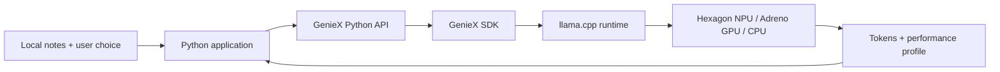

# GenieX 101: Build Your First Local AI Application on Snapdragon

> **Historical standalone plan.** The current [120-minute structure](../../WORKSHOP-STRUCTURE.md) supersedes this event schedule and its proposed 201 direction. Retained for background; use the new detailed 101/201/301 labs for delivery.

**Status:** Curriculum draft for technical review
**Recommended duration:** 2 hours 30 minutes
**Compressed event format:** 2 hours; omit the optional experiment in Module 5 and use a facilitator-led setup
**Delivery mode:** Instructor-led, one Snapdragon laptop per participant or pair
**Primary platform:** Windows ARM64 on Snapdragon X-series
**Hands-on interface:** GenieX CLI followed by the GenieX Python SDK
**Research snapshot:** Official GenieX repository and documentation reviewed at commit [`0286796`](https://github.com/qualcomm/GenieX/commit/028679632ef3d472b0e0d3a77efbed5d9e76ab8d), 1 September 2026

## 1. Workshop promise

In this workshop, participants run a language model locally on a Snapdragon device, trace how GenieX routes inference to Snapdragon compute, and turn a first inference into a small, useful Python application.

The application is a **Local Briefing Assistant**. It reads event or meeting notes from a local text file and lets the user:

- create a concise briefing;
- extract action items in a predictable format; or
- turn the same source text into a short developer update.

The application streams its answer and displays GenieX performance data such as time to first token, prompt and generated token counts, and decode speed. Model weights and input data stay on the device during inference.

This is not a product slideshow. Every concept is attached to an observation, decision, or code change.

## 2. Why this is the right 101

The official documentation describes GenieX as an on-device generative-AI inference runtime for Qualcomm Snapdragon and the community version of Qualcomm GENIE. A common C SDK sits underneath five entry points: CLI, Python, Java/Kotlin, Docker, and an OpenAI-compatible local server. The SDK dispatches to one of two runtimes:

- `llama_cpp`, for GGUF models with NPU, GPU, CPU, or hybrid execution; and
- `qairt`, Qualcomm AI Engine Direct, for chipset-specific Qualcomm AI Hub bundles on the NPU.

That architecture suggests a deliberate beginner journey:

1. **Experience it:** run a model from the CLI and see local generation.
2. **Explain it:** trace interface → SDK → runtime → compute unit → output.
3. **Program it:** use the real `AutoModelForCausalLM.from_pretrained()` and `.generate()` Python API.
4. **Build with it:** add input handling, prompt construction, streaming, and application logic.
5. **Observe it:** read GenieX's own inference profile and explain one performance metric.

This follows the useful patterns in NVIDIA DLI teaching materials: explicit outcomes, short lectures, hands-on labs, coding projects, checks for understanding, sample solutions, and an applied challenge. It is intentionally modular so the same kit can support an instructor-led event or a self-guided lab.

## 3. Audience, prerequisites, and non-goals

### Intended audience

- Application developers and students who can read basic Python.
- ML developers new to on-device inference.
- Developers evaluating Snapdragon for private, responsive, offline-capable AI experiences.

Participants do **not** need prior model training, Qualcomm AI Engine Direct, C++, or Android experience.

### Participant prerequisites

- Basic Python: functions, lists/dictionaries, file reading, and exceptions.
- Basic command-line use.
- A GitHub account only if the event includes submission or sharing.

### Technical prerequisites

- A supported Windows ARM64 Snapdragon X-series device. GenieX does not provide an x86 or non-Snapdragon ARM build.
- Native ARM64 Python 3.10 or newer. `platform.machine()` must report `ARM64`, not `AMD64`.
- GenieX CLI and Python SDK installed and verified.
- A workshop-tested GGUF model pre-cached on every device.
- Workshop repository downloaded before the event.

Qualcomm Device Cloud can be an alternative for events without physical devices, but it needs a separate facilitator runbook and should not be introduced as an untested last-minute fallback.

### Non-goals for 101

- model training, fine-tuning, conversion, or quantization;
- choosing among many models or conducting formal model evaluation;
- multimodal, audio, Android, Docker, C/C++, or production deployment;
- RAG, embeddings, tool calling, agents, or a multi-turn chat architecture;
- detailed QAIRT versus llama.cpp benchmarking.

Those topics are deliberately reserved for GenieX 201 or later workshops.

## 4. Measurable learning objectives

By the end, a successful participant can:

1. Explain in plain language what GenieX does and why local inference can matter.
2. Identify the five GenieX entry points and trace the workshop's Python path through the SDK, `llama_cpp`, and Snapdragon compute.
3. Distinguish a GGUF model used by `llama_cpp` from a pre-compiled Qualcomm AI Hub bundle used by `qairt`.
4. Verify a supported device, native ARM64 Python, GenieX installation, detected chipset, and cached model.
5. Run a real text model with the GenieX CLI.
6. Load a model, apply its chat template, generate a response, stream output, and close the model with the GenieX Python SDK.
7. Build the Local Briefing Assistant by separating user input, prompt construction, inference, and output presentation.
8. Interpret at least two fields from `output.profile`, including time to first token or decode speed.
9. State one limitation of the prototype and one appropriate next step.

## 5. Mental model taught in the workshop



The broader platform view is introduced, but participants follow only the highlighted Python → `llama_cpp` route in 101:

```text
CLI | Python | Java/Kotlin | Docker | OpenAI-compatible local server
                              ↓
                         GenieX SDK
                    ↙                     ↘
       llama.cpp + community GGUF       qairt + AI Hub bundle
           NPU / GPU / CPU / hybrid             NPU
```

Key vocabulary is limited to what participants need immediately:

- **Inference:** running an already trained model to produce an output.
- **On-device:** model execution happens on the Snapdragon device rather than a remote model API.
- **Model weights:** the learned numerical parameters loaded for inference.
- **Token:** a unit of text processed or generated by the model.
- **Quantization:** representing weights at lower precision to reduce memory and compute needs. The released workshop will pin a tested `Q4_0` GGUF variant because the GenieX documentation recommends `Q4_0` for Hexagon NPU support.
- **Runtime:** the software implementation that executes the model. GenieX offers `llama_cpp` and `qairt` paths.
- **Compute unit:** NPU, GPU, CPU, or the supported hybrid path.
- **Chat template:** model-specific formatting applied to role-based messages before generation.
- **Streaming:** presenting output chunks as they arrive rather than waiting for the complete answer.
- **Time to first token (TTFT):** how long the user waits before the first generated token appears.
- **Decode speed:** the rate at which output tokens are generated.

## 6. Workshop at a glance

| Time | Module | Learning mode | Participant evidence |
|---:|---|---|---|
| 0–10 min | 0. Hook and readiness | Prediction poll + device check | Green readiness result |
| 10–25 min | 1. What runs where? | Mini-lesson + architecture card sort | Correct inference-path explanation |
| 25–45 min | 2. First local inference | Instructor demo + paired CLI lab | Working CLI response and observation |
| 45–55 min | 3. Runtime and model choices | Decision game | Correct runtime choice in two scenarios |
| 55–80 min | 4. First inference from Python | Live coding + code completion | Streaming Python output and profile |
| 80–90 min | Break and support checkpoint | Open support | All pairs ready for build |
| 90–125 min | 5. Build the Local Briefing Assistant | Guided build with choice points | Working application with two modes |
| 125–140 min | 6. Observe and improve | Small experiment + pair discussion | One evidence-backed improvement |
| 140–150 min | 7. Demo, assessment, next step | Lightning demos + exit ticket | Passed skills check and reflection |

Target talking time is no more than 35–40 minutes. At least 70 minutes is spent running or changing code.

## 7. Detailed module content

### Module 0 — Hook and readiness (10 minutes)

**Hook:** Ask participants to vote before revealing the answer:

> When this assistant answers, which components need the internet: the application, the prompt, the model, or none of them after setup?

Run one already-cached prompt, then optionally disconnect the demonstration device from the network and run it again. Frame this as evidence about this prepared inference path, not a claim that all AI applications are automatically offline.

Participants run the event-provided readiness script. Until that script exists, the underlying checks are:

```powershell
python -c "import platform; print(platform.machine())"
python -c "import geniex; print(geniex.version())"
geniex --help
geniex config get chipset
geniex list
```

**Pass condition:** native `ARM64`, GenieX imports, the CLI starts, a supported chipset is detected or configured, and the workshop model appears in the local cache.

**Facilitator rule:** Do not spend group teaching time downloading multi-gigabyte weights. Move a participant to a known-good pair/device while support resolves the cache issue.

### Module 1 — What runs where? (15 minutes)

Explain only the concepts shown in the two diagrams above. Then give pairs interface, SDK, runtime, model-format, and compute-unit cards. They have 90 seconds to assemble two valid paths:

- Python → GenieX SDK → `llama_cpp` → GGUF → NPU/GPU/CPU; and
- CLI → GenieX SDK → `qairt` → Qualcomm AI Hub bundle → NPU.

**Check for understanding:**

- Does Python itself run the model? No; it calls the GenieX SDK.
- Can a `qairt` bundle be moved to an arbitrary chipset unchanged? No; it is compiled per chipset.
- Does “on-device” mean “NPU only”? No; GenieX can use different compute units depending on runtime and model.

### Module 2 — First local inference from the CLI (20 minutes)

The facilitator launches the pre-cached, workshop-validated model. The pinned release target is:

```powershell
geniex infer unsloth/Qwen3.5-2B-GGUF:Q4_0 --compute npu --think=false --max-tokens 128
```

The event release must pin the exact model repository, selected GGUF file/precision, license record, expected cache size, and SHA/version metadata in `setup/versions.json`. The model above is a current official quickstart example, not an eternal workshop dependency.

Participants enter three prompts:

1. `Explain on-device AI to a 12-year-old in two sentences.`
2. `Explain on-device AI to an application developer in two sentences.`
3. A prompt of their own that changes audience, format, or length.

Pairs record:

- what stayed the same;
- what changed because of the instruction; and
- one sign that this is more than a hard-coded response.

**Micro-challenge:** Improve an intentionally vague prompt. Each pair must add an audience, purpose, and output constraint, then compare results.

**Checkpoint:** Every pair can identify the model identifier, compute choice, system/user instruction, and generated output.

### Module 3 — Choose the path (10 minutes)

Use a two-scenario decision game instead of another lecture:

1. “I found a compatible community GGUF model on Hugging Face and may need CPU fallback.” → `llama_cpp`.
2. “My model is available as a chipset-specific Qualcomm AI Hub bundle and I want the optimized NPU path.” → `qairt`.

Reveal the comparison:

| Decision | `llama_cpp` | `qairt` / Qualcomm AI Engine Direct |
|---|---|---|
| Model source | Compatible GGUF, commonly from Hugging Face | Pre-compiled Qualcomm AI Hub bundle |
| Portability | Broad GGUF coverage | Compiled for a supported chipset |
| Compute | NPU, GPU, CPU, or hybrid | NPU |
| Precision choice | Chosen when selecting/downloading GGUF | Baked into bundle |
| 101 use | Yes | Explain, then defer hands-on comparison |

### Module 4 — First inference from Python (25 minutes)

First ask participants to mark the four boundaries in the code: load, format, generate, release. Then run the official API shape:

```python
from geniex import AutoModelForCausalLM

MODEL_ID = "unsloth/Qwen3.5-2B-GGUF"

messages = [
    {"role": "system", "content": "You are a concise technical explainer."},
    {"role": "user", "content": "Explain why local inference can be useful."},
]

with AutoModelForCausalLM.from_pretrained(
    MODEL_ID,
    precision="Q4_0",
    device_map="npu",
) as model:
    prompt = model.tokenizer.apply_chat_template(
        messages,
        tokenize=False,
        add_generation_prompt=True,
        enable_thinking=False,
    )

    streamer = model.generate(
        prompt,
        max_new_tokens=160,
        temperature=0.3,
        stream=True,
    )

    for chunk in streamer:
        print(chunk, end="", flush=True)

    profile = streamer.output.profile
    print(
        # GenieX 0.5.0 exposes this timing value in microseconds.
        f"\nTTFT: {profile.ttft / 1_000.0:.1f} ms | "
        f"Prompt: {profile.prompt_tokens} tok | "
        f"Generated: {profile.generated_tokens} tok | "
        f"Decode: {profile.decode_speed:.1f} tok/s"
    )
```

**Code-completion activity:** Participants receive this sample with four meaningful blanks, not an empty file. Early finishers change `max_new_tokens`, `temperature`, or the requested output format and predict the effect before running it.

**Important teaching points:**

- `apply_chat_template()` uses the model's expected role formatting; concatenating arbitrary strings is not the same operation.
- Streaming changes when output becomes visible; it does not mean the complete answer was generated in advance.
- The model should be closed, preferably with a context manager, to release resources.
- In GenieX 0.5.0, Python `ProfileData.ttft` is a microsecond value; divide by 1,000 before labeling it milliseconds. Recheck this normalization when upgrading GenieX.
- A single run is an observation, not a benchmark.

### Module 5 — Build: Local Briefing Assistant (35 minutes)

Participants complete a scaffold rather than copy a finished application.

**User story**

> As an event organizer, I want to turn local notes into a concise briefing or action list without sending those notes to a remote model endpoint.

**Starter repository shape**

```text
starter/
├── app.py                 # CLI arguments and presentation
├── inference.py           # GenieX load, generate, stream, and profile
├── prompts.py             # mode-specific message construction
└── sample-data/
    └── event-notes.txt
```

**Required behavior**

- Accept `--file` and `--mode` (`brief` or `actions`).
- Reject a missing or empty file with a useful message.
- Build role-based messages for the selected mode.
- Apply the model's chat template.
- Stream the result.
- Print TTFT and decode speed after generation.
- Close the model even when generation fails.

**Prompt contracts**

`brief` mode requests:

- a one-sentence purpose;
- three key points; and
- one open question.

`actions` mode requests a Markdown table with owner, action, and due-date columns. The model must write `unknown` rather than invent missing values.

**Three staged checkpoints**

1. **Input works:** print file length and selected mode; do not load the model yet.
2. **Inference works:** generate one non-streaming result from the file.
3. **Experience works:** add streaming, profile display, validation, and the second mode.

**Choice point:** Each pair adds one small differentiator—another output mode, a word-limit control, a custom audience, or saving the result to a new file. This creates variety for demos without expanding the platform scope.

**Facilitator prompts while circulating:**

- Which lines are generic Python, and which lines are GenieX-specific?
- What data leaves this process in the current design?
- Where could an untrusted file alter the instruction?
- What would you test before presenting this output as fact?

### Module 6 — Observe and improve (15 minutes)

Pairs choose one controlled comparison:

- concise prompt versus verbose prompt;
- `max_new_tokens=80` versus `160`; or
- non-streaming versus streaming user experience.

They run each variant twice, record TTFT, prompt tokens, generated tokens, decode speed, and a one-line quality observation. They must avoid claiming a winner from a tiny sample.

**Discussion:** Separate perceived responsiveness (streaming and TTFT) from generation throughput (decode speed) and answer quality. Formal benchmarking, warmups, repeated trials, and `geniex-bench` belong in 201.

### Module 7 — Demo and assessment (10 minutes)

Select two or three pairs for 60-second demos:

1. What problem does your mode solve?
2. Which GenieX calls make it work?
3. What did your measurement show?
4. What would you change next?

Every participant completes an exit ticket:

- Draw or order the five boxes in the workshop inference path.
- Pick `llama_cpp` or `qairt` for one model scenario and explain why.
- Point to load, template, generate, stream, profile, and close in their code.
- Name one reason the prototype is not yet production-ready.

## 8. Assessment rubric

Use the rubric for coaching, not ranking.

| Criterion | Emerging | Workshop-ready | Strong evidence |
|---|---|---|---|
| GenieX integration | Needs a completed solution | Loads and generates with the real SDK | Also streams, closes safely, and exposes profile data |
| Application design | One hard-coded prompt | Accepts a local file and supports two modes | Clear separation of input, prompts, inference, and presentation |
| Reliability | Fails opaquely | Handles missing/empty input | Gives useful errors and releases resources on failure |
| Platform understanding | Cannot trace execution | Correctly traces the 101 path | Can also explain when `qairt` is the better path |
| Observation | Reports “fast” or “slow” | Records at least two profile fields | Distinguishes responsiveness, throughput, and quality |
| Communication | Shows only output | Explains problem and design | States evidence, limitation, and next experiment |

**Completion standard:** all “Workshop-ready” cells plus a working demonstration on Snapdragon.

## 9. GenieX 101 versus GenieX 201

The workshop series should deepen the same mental model rather than repeat setup with more slides.

| Dimension | GenieX 101 | GenieX 201 |
|---|---|---|
| Promise | Build a first local text application | Design and justify a multimodal local AI pipeline |
| Build | Local Briefing Assistant | Multimodal Field Inspection Copilot: image + instruction → structured report |
| Model path | One pre-validated GGUF through `llama_cpp` | A VLM plus a tested `qairt`/GGUF comparison where hardware permits |
| Interfaces | CLI and direct Python SDK | Python VLM API and OpenAI-compatible local server |
| Inputs | Text file | Text + image; audio is an extension if the selected GGUF supports it |
| Generation | Chat template, streaming, basic parameters | Structured/JSON output, constraints, context strategy, cancellation, error paths |
| State | Single request | Multi-turn state, `reset()`, and KV-cache concepts where useful |
| Performance | Read built-in profile fields | Use `geniex-bench`, warmups, repeated trials, runtime/compute comparisons |
| Deployment thinking | Local prototype | Integration boundary, concurrency, memory/context constraints, observability |
| Final evidence | Working app + architecture explanation | Working pipeline + benchmark/evaluation report + deployment recommendation |

### Proposed GenieX 201 capstone

Build a **Multimodal Field Inspection Copilot** that accepts a local image and inspection instructions, generates a structured report, exposes the model through the local OpenAI-compatible server or Python API, and measures TTFT, prefill, and decode behavior. Teams must explain their runtime/model choice, validate the report against a simple rubric, and document one failure case.

201 should use only models and features validated on the event hardware. The current official examples include `ai-hub-models/Qwen2.5-VL-7B-Instruct` for a QAIRT VLM and supported GGUF VLM paths, but the released workshop must pin a tested asset rather than follow a floating example.

## 10. Interaction design and energy

To keep delivery lively and useful across developer events:

- Start with a prediction and immediate proof, not architecture slides.
- Alternate explanation and action every 10–15 minutes.
- Use pairs for setup and debugging; rotate driver/navigator after the break.
- Ask participants to predict parameter effects before running code.
- Keep a visible “green / amber / blocked” readiness board so support is proactive.
- Provide progressive hints: concept hint, API hint, then code hint.
- Include optional “stretch” cards so fast participants do not race ahead into unsupported topics.
- Use participant-selected input in the final demo, while retaining safe sample data.
- End each module with observable evidence, not “Any questions?”

## 11. Facilitator and event operations

### Before the event

- Pin and record the GenieX version, workshop commit, Python version, device/chipset, model repository, exact model file/precision, license, cache size, and checksums.
- Validate the full lab on a clean Windows ARM64 user profile.
- Pre-cache the model and verify inference with the network unavailable.
- Confirm disk space, power settings, terminal execution policy, and ARM64 Python precedence on `PATH`.
- Prepare a tested recovery archive or local model cache distribution method permitted by the model license.
- Run a timed rehearsal with someone who did not author the lab.
- Prepare a two-minute backup recording, expected-output screenshots, and at least one spare device.

### During the event

- Never expose access tokens on screen or commit them to the repository.
- Put commands in the participant guide so nobody must retype URLs or model identifiers from a slide.
- Pair blocked participants with a known-good environment after five minutes.
- Label performance results with device, model, precision, runtime, compute, input, and GenieX version.
- Treat model output as untrusted generated content and discuss verification.

### Known high-probability problems

| Symptom | First check | Recovery |
|---|---|---|
| `platform.machine()` is `AMD64` | x86 Python or emulated shell is first on `PATH` | Switch to native ARM64 Python and recreate the venv |
| `geniex` is not found after install | New terminal has not inherited updated `PATH` | Open a new PowerShell window; verify installer path |
| Model starts downloading | Cache was not staged or identifier/precision differs | Move participant to paired device; restore tested cache after the module |
| Model load/inference fails | Device, free memory, model manifest, runtime, compute choice | Run readiness checks; use the pinned reference configuration |
| Context limit error | Source text/output budget is too large | Use the workshop sample, reduce input, or lower output budget |
| Output invents owners/dates | Prompt contract is insufficient or source is incomplete | Require `unknown`; verify output against source |
| First run is slower | Model load/warm state differs | Explain cold versus warm observations; do not call it a benchmark |

## 12. GitHub publication structure

```text
qualcomm-snapdragon-multiverse-workshops/
├── README.md
├── CONTRIBUTING.md
├── LICENSE
└── workshops/
    └── geniex-101/
        ├── README.md
        ├── setup/
        │   ├── README.md
        │   ├── verify_environment.ps1
        │   └── versions.json
        ├── labs/
        │   ├── 00-readiness.md
        │   ├── 01-cli-first-inference.md
        │   ├── 02-python-first-inference.ipynb
        │   ├── 03-local-briefing-assistant.md
        │   └── 04-observe-and-improve.md
        ├── starter/
        │   ├── app.py
        │   ├── inference.py
        │   ├── prompts.py
        │   └── sample-data/event-notes.txt
        ├── solution/
        ├── tests/
        ├── instructor/
        │   ├── FACILITATOR-GUIDE.md
        │   ├── RUN-OF-SHOW.md
        │   ├── TROUBLESHOOTING.md
        │   └── answer-key/
        ├── slides/
        └── assets/
```

Avoid using solution branches as the primary distribution mechanism. Versioned folders/tags and hidden-by-default solution links are easier to maintain, review, and use offline.

## 13. Build and publication action plan

### Phase 0 — Lock the event target

**Outputs:** `versions.json`, hardware matrix, model/license record, go/no-go checklist.

- Select the exact Snapdragon X device(s) and Windows build.
- Pin a released GenieX build rather than depending on a floating developer-preview package.
- Validate a small GGUF model and `Q4_0` file on NPU.
- Decide whether Qualcomm Device Cloud is officially supported for this delivery.

**Acceptance:** the same scripted inference succeeds twice on every target device class, including once with the network disconnected after setup.

### Phase 1 — Build the golden path

**Outputs:** reference app, sample data, automated tests, expected outputs.

- Implement the Local Briefing Assistant against the real Python SDK.
- Add input validation, streaming, profiling, and safe model cleanup.
- Add tests for generic application logic without requiring a model, plus one hardware smoke test.
- Record cold/warm timings only for facilitator capacity planning.

**Acceptance:** a clean-room reviewer completes the app from the lab without opening the solution.

### Phase 2 — Build the participant experience

**Outputs:** setup guide, readiness script, four labs, starter files, progressive hints, exit ticket.

- Write instructions around observable checkpoints and expected output shapes.
- Keep setup out of the timed workshop wherever possible.
- Add callouts for download size/time and developer-preview behavior.
- Check every command by copy/paste in a fresh PowerShell session.

**Acceptance:** no placeholder imports, fake APIs, hard-coded “WORKSHOP_DEFAULT_MODEL” values, or unverified commands remain.

### Phase 3 — Build the instructor kit

**Outputs:** slides, speaker notes, run of show, troubleshooting decision tree, solution, backup demo.

- Keep slides to concepts, diagrams, prompts, checkpoints, and discussion—not walls of code.
- Add exact timeboxes and recovery choices for 120- and 150-minute delivery.
- Include an environment triage role for events above 25 participants.

**Acceptance:** a facilitator who did not write the material can deliver it from the kit.

### Phase 4 — Pilot and revise

**Outputs:** pilot log, timing data, issue list, revised content.

- Pilot with 6–10 developers across beginner and ML-experienced profiles.
- Track completion per checkpoint, not just satisfaction.
- Revise any step where fewer than 80% finish without direct instructor intervention.
- Review accessibility: color-independent status, alt text, readable terminal theme, keyboard-only path, and downloadable text equivalents.

**Acceptance:** at least 80% meet the completion standard within the published duration.

### Phase 5 — Publish and maintain

**Outputs:** tagged GitHub release, release notes, maintenance owner, feedback path.

- Add license, contribution guidance, code of conduct, support boundaries, and attribution.
- Link only to official GenieX/Qualcomm documentation for product claims.
- Run Markdown/link linting and Python tests in CI; keep hardware inference as a documented release gate.
- Tag the workshop release and record the tested matrix in release notes.
- Revalidate whenever GenieX, the selected model, Windows, or target hardware changes.

**Acceptance:** every published workshop release is reproducible from its version manifest and has a named maintainer.

## 14. Definition of done for GenieX 101

The workshop is ready to publish only when:

- all product claims and code use the official GenieX naming and real API;
- the participant path has no unmarked placeholders;
- all commands pass on the stated Snapdragon hardware and native ARM64 Python;
- the model is pinned, licensed for the intended distribution method, pre-cached, and documented;
- the lab works without network access after prerequisites are staged;
- a non-author has completed the lab within the timebox;
- the instructor guide covers the five highest-probability failures;
- the assessment measures each stated objective;
- 101 content does not depend on an unintroduced 201 concept; and
- references, version metadata, maintenance ownership, and feedback channels are present.

## 15. Source material

Product facts and API examples in this draft are grounded in these official sources:

- [GenieX: What is GenieX](https://geniex.aihub.qualcomm.com/en/get-started/what-is-geniex)
- [GenieX platforms and runtimes](https://geniex.aihub.qualcomm.com/en/get-started/platforms)
- [GenieX models and quantizations](https://geniex.aihub.qualcomm.com/en/models/supported)
- [GenieX CLI install and quickstart](https://geniex.aihub.qualcomm.com/en/run/cli/install)
- [GenieX CLI reference](https://geniex.aihub.qualcomm.com/en/run/cli/reference)
- [GenieX Python install and quickstart](https://geniex.aihub.qualcomm.com/en/run/python/install)
- [GenieX Python API reference](https://geniex.aihub.qualcomm.com/en/run/python/api-reference)
- [Official GenieX repository](https://github.com/qualcomm/GenieX)
- [Official Windows Python notebook](https://github.com/qualcomm/GenieX/blob/main/examples/python/windows.ipynb)
- [NVIDIA DLI Teaching Kit Program](https://developer.nvidia.com/teaching-kits/)

GenieX is currently described by Qualcomm as a developer preview. Commands, packages, supported models, and hardware can change; the version manifest and release validation are therefore part of the curriculum, not optional administrative work.
